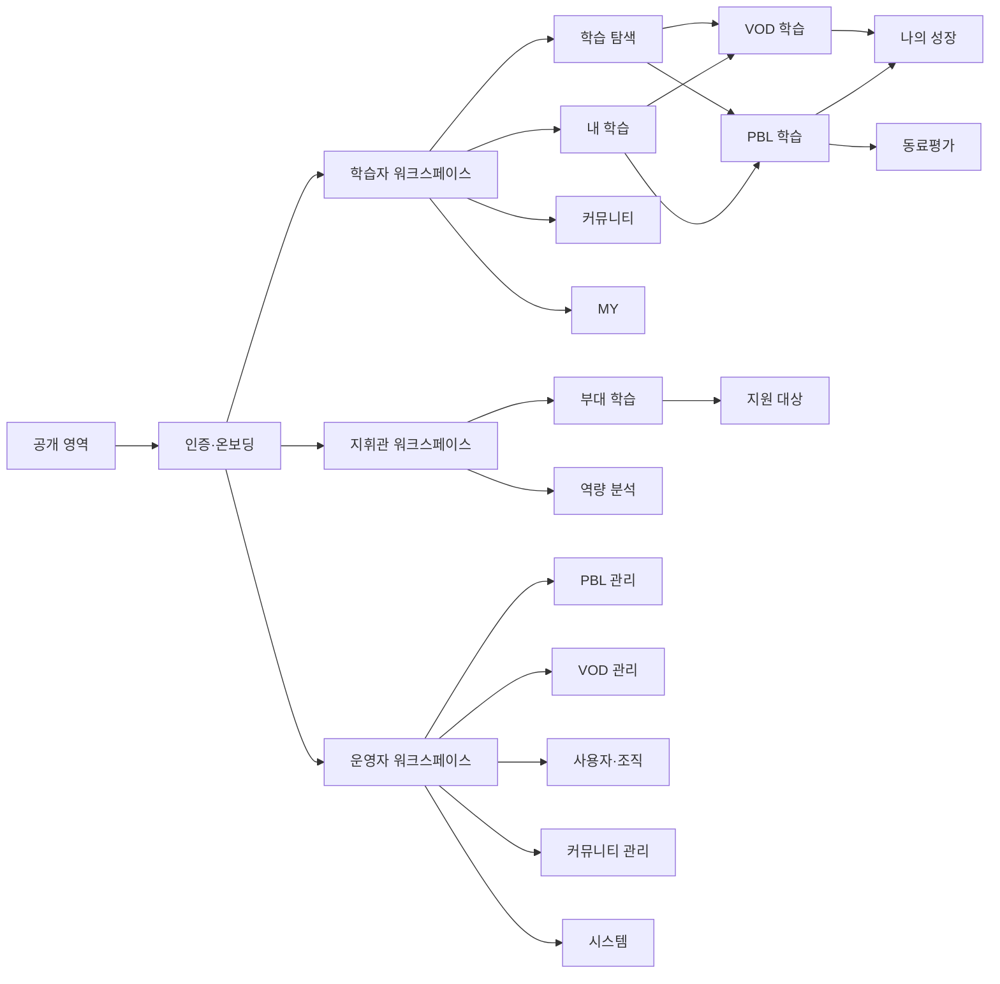
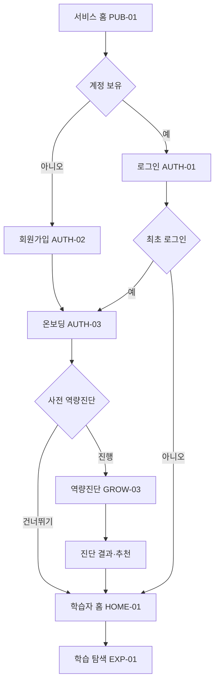
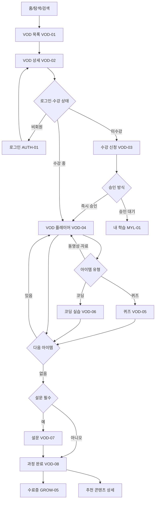
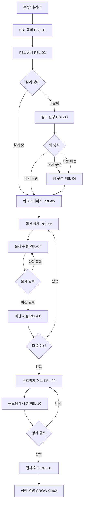
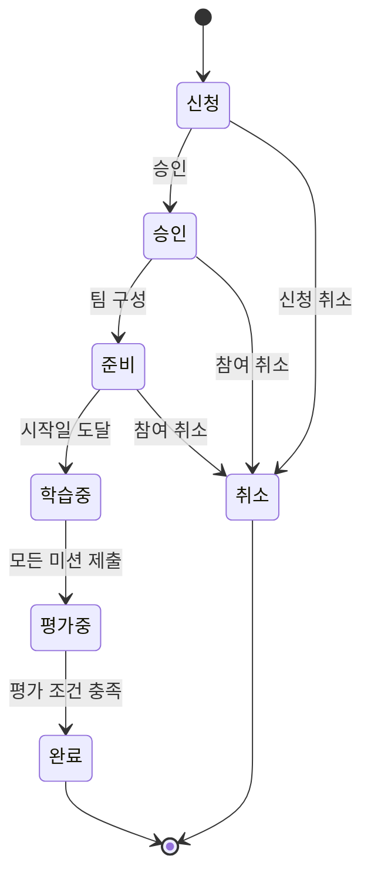
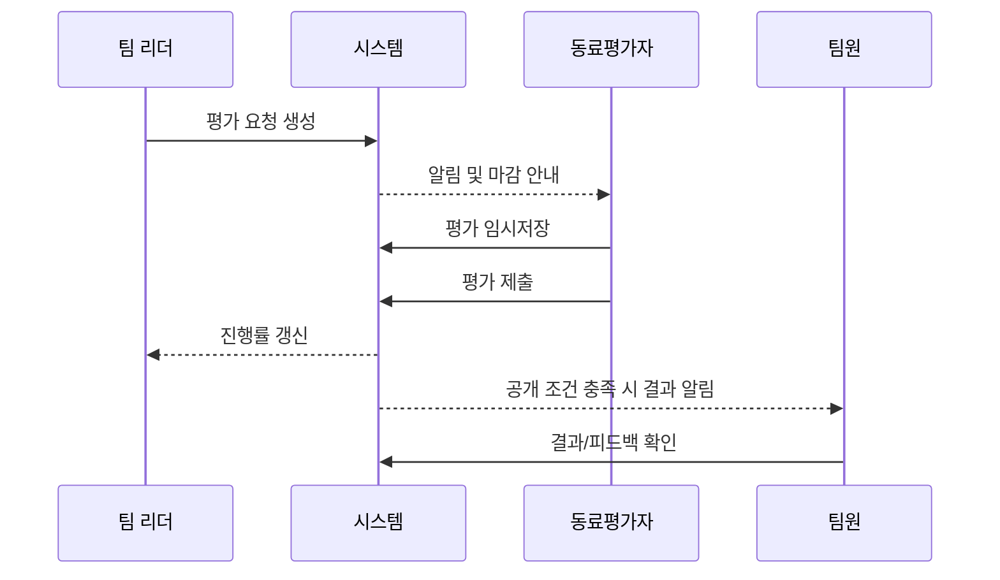
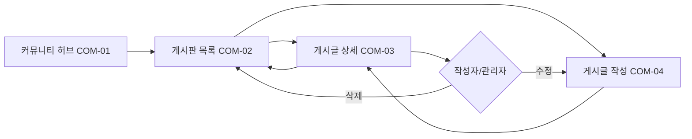
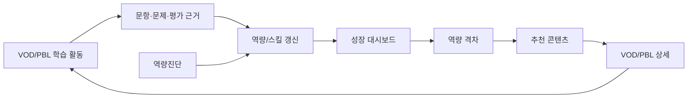
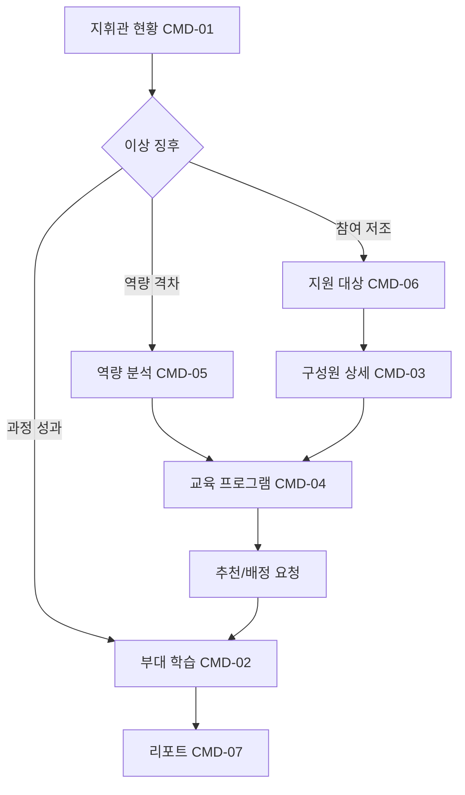
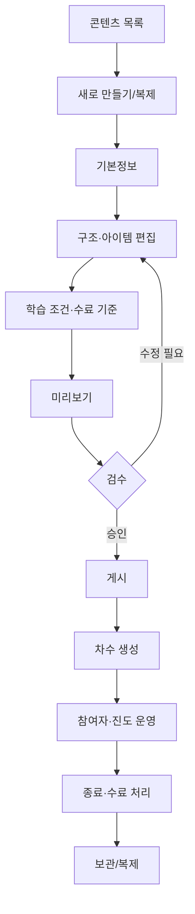

# 03. 페이지 연결과 핵심 사용자 흐름

## 1. 전체 서비스 구조

## 2. 신규 학습자 진입

예외:

- 가입 중 소속 부대/계급 조회 실패 → 직접 입력이 아니라 재시도/문의로 제한한다.
- 최초 로그인 이후 온보딩을 중단하면 홈에 `온보딩 이어하기` 배너를 표시한다.
- 보호 화면에서 로그인한 경우 홈보다 원래 목적지로 복귀한다.

## 3. VOD 핵심 흐름

VOD 연결 규칙:

| 출발 | 액션 | 도착 | 뒤로가기/복귀 |
|---|---|---|---|
| VOD-01 | 카드 선택 | VOD-02 | 필터·스크롤 유지 |
| VOD-02 | 학습 시작 | 마지막 학습 아이템 VOD-04 | 상세 |
| VOD-04 | 목차 선택 | 선택 아이템 VOD-04/05/06 | 동일 플레이어 컨텍스트 |
| VOD-05/06 | 제출 완료 | 결과 상태 또는 다음 아이템 | 답안/결과 유지 |
| VOD-08 | 미완료 항목 선택 | 해당 아이템 | 완료 화면으로 복귀 가능 |

## 4. PBL 핵심 흐름

PBL 상태 전이:

ERD 상태와의 대응:

| 사용자 문구 | 예상 코드 |
|---|---|
| 신청 | `APPLIED` |
| 승인 | `ACCEPTED` |
| 취소 | `CANCELED` |
| 준비 | `PREPARING` / 미션 `STANDBY` |
| 학습 중 | `LEARNING` / 미션 `DOING` |
| 평가 중 | 미션 `DONE` 또는 `EVALUATED` 전 |
| 완료 | `FINISHED` / 미션 `EVALUATED` |

## 5. 동료평가

화면 연결:

- 홈의 `평가 마감` 카드 → PBL-10
- 내 학습의 `평가 필요` 탭 → PBL-09
- 알림의 `평가 요청` → PBL-10
- 제출 후 → PBL-09의 완료 상태
- 전체 평가 종료 알림 → PBL-11

## 6. 커뮤니티

게시판 유형별 차이:

| 유형 | 목록 | 상세 | 작성 |
|---|---|---|---|
| 공지 | 고정/중요 배지 | 중요도, 첨부 | 운영자 중심 |
| Q&A | 답변 상태, 분류 | 질문과 답변 | 회원 |
| FAQ | 카테고리, 검색 | 접기/펼치기 가능 | 운영자 |
| 뉴스 | 썸네일, 발행일 | 본문/관련 링크 | 운영자 |
| 동료평가 글 | 프로젝트/팀 범위 | 공개 정책 필요 | 시스템 또는 팀 |
| AI 대화 공유 | 컨텍스트/공개 범위 | 대화 스냅샷 | 회원, 정책 필요 |

## 7. 성장·추천 루프

추천 카드에는 최소한 `추천 대상 콘텐츠`, `관련 스킬`, `현재 수준/목표 수준`, `추천 사유`를 표시한다. ERD의 추천 테이블은 스킬명·설명·레벨을 가지지만 추천 알고리즘과 노출 우선순위는 정책 확인이 필요하다.

## 8. 지휘관 흐름

개인 상세는 민감도가 높으므로 `본인 소속 범위`, `업무 필요성`, `행동 로그`를 전제로 한다. 권한 미확정 시 UI는 집계 데이터 중심으로 디자인한다.

## 9. 운영자 콘텐츠 제작 흐름

PBL은 `프로젝트 → 미션 → 문제`, VOD는 `과정 → 목차 → 학습 아이템`의 구조 편집기를 사용한다. 두 편집기의 화면 골격은 같게 만들되, 아이템 속성은 분리한다.

## 10. 딥링크·상태 보존 규칙

- 목록 → 상세 → 뒤로가기는 검색어, 필터, 정렬, 페이지, 스크롤을 복원한다.
- 알림 딥링크는 대상이 삭제/종료됐을 때 상위 목록과 사유를 보여준다.
- 플레이어/워크스페이스는 마지막 위치를 저장하고 `이어하기`로 복귀한다.
- 수강 기간 만료 후 학습 URL 접근 시 상세 또는 완료 화면으로 안내한다.
- 운영자 편집 URL에 권한이 없으면 데이터 존재 여부를 노출하지 않고 접근 제한 화면으로 이동한다.
- 외부 공유가 가능한 것은 공개 콘텐츠 상세, 공개 게시글, 수료증 검증 링크로 제한한다.

