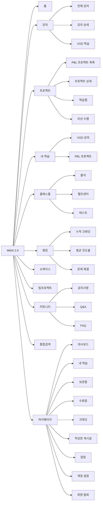

# MiliAI 2.0 현행 메뉴 및 페이지 목록

> 기준: 학생 계정으로 실제 서비스 화면 확인
>
> 확인일: 2026-07-29
>
> 기준 경로: `/llm/chat/miliai2`

## 1. 메뉴 구조

## 2. 페이지 목록

| 구분 | 페이지 | 경로 |
|---|---|---|
| 홈 | 메인 홈 | `/` |
| 강의 | 강의 목록 | `/course/list` |
| 강의 | 강의 상세 | `/course/{courseId}` |
| 강의 | VOD 학습 플레이어 | `/course/content/{contentId}` |
| 프로젝트 | PBL 프로젝트 목록 | `/course/project` |
| 프로젝트 | 프로젝트 상세 | `/course/project/{projectId}` |
| 프로젝트 | 프로젝트 학습맵 | `/course/project/{projectId}/map` |
| 프로젝트 | 미션 수행 | `/course/project/{projectId}/mission/{missionId}` |
| 학습 | 내 학습 | `/mypage/my-learning` |
| 클래스룸 | 클래스룸 목록 | `/classroom/` |
| 클래스룸 | 클래스룸 상세 | `/classroom/{type}/{id}` |
| 클래스룸 | 헬프센터 | `/classroom/{type}/{id}/helpdesk` |
| 클래스룸 | 질문 작성 | `/classroom/{type}/{id}/helpdesk/new` |
| 랭킹 | 랭킹보드 | `/ranking` |
| 커뮤니티 | 쇼케이스 | `/board/SHOWCASE` |
| 커뮤니티 | 공지사항 | `/board/NOTICE` |
| 커뮤니티 | Q&A | `/board/QNA` |
| 커뮤니티 | FAQ | `/board/FAQ` |
| 커뮤니티 | 게시글 작성 | `/board/{boardType}/write` |
| 협업 | 팀프로젝트 | `/mypage/teams` |
| 검색 | 통합검색 | `/search/` |
| 마이 | 대시보드 | `/mypage/` |
| 마이 | 온보딩 설문 | `/mypage/onboarding` |
| 마이 | 역량 진단평가 | `/mypage/level-test` |
| 마이 | 보관함 | `/mypage/wishlist` |
| 마이 | 수료증 | `/mypage/certs` |
| 마이 | 크레딧·보상 | `/mypage/credit` |
| 마이 | 작성한 게시글 | `/mypage/my-posts` |
| 마이 | 알림 | `/mypage/notifications` |
| 마이 | 계정 설정 | `/mypage/profile` |
| 마이 | 회원 탈퇴 | `/mypage/withdraw` |
| 기타 | 학습 로드맵 | `/roadmap` |
| 기타 | 서비스 소개 | `/page/about` |
